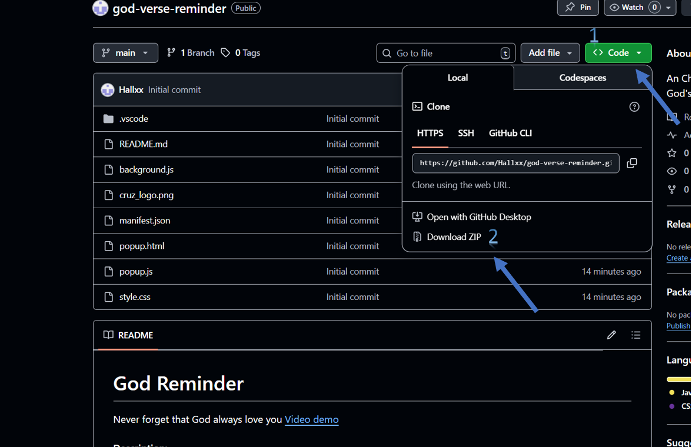

# God Verse Reminder

Never forget that God always love you [Video demo](https://youtu.be/F655f1kfDaQ)

## Description

### Inspiration and Personal Motivation

I am a Christian, and like many people, there are moments in my life when I feel overwhelmed by emotions. Sometimes I feel sad, angry, stressed, anxious, frustrated, or simply tired. In those moments, I need to hear God's voice and be reminded of His presence, His promises, and His love. I believe that God speaks to us through His Word, and that the Bible is a constant source of comfort, guidance, and strength.

That personal need is what inspired me to create God Verse Reminder, a simple but meaningful Chrome Extension designed to remind users that God is always with them. This extension periodically displays Bible verses as notifications on your screen, helping you pause for a moment, reflect, and reconnect with God throughout your day.

### The Problem This Extension Solves

In today's fast-paced world, it's easy to get caught up in daily responsibilities, work deadlines, academic pressures, and personal challenges. We often find ourselves so busy that we forget to take a moment to breathe, reflect, and connect with our faith. Even as believers, we can go hours or even entire days without reading Scripture or remembering God's promises.

This is especially true when we're facing difficult times. During moments of stress, anxiety, or sadness, we need spiritual encouragement the most, yet those are often the times when we neglect to seek it. We might tell ourselves we'll read the Bible later, or we simply forget in the midst of everything else demanding our attention.

God Verse Reminder was created to bridge this gap. It serves as a gentle, consistent reminder that God is present in every moment of our lives, not just when we remember to seek Him. The extension brings Scripture directly to you, wherever you are working, studying, or browsing, eliminating the barrier of having to remember to open your Bible or Bible app.

### How It Works in Daily Life

In the middle of daily routines, responsibilities, studies, work, or moments of stress, it is easy to forget to stop and listen. God Verse Reminder acts as a gentle reminder that God has not left us, that He is still speaking, and that His Word is always available to encourage us. Each notification is meant to be a small moment of peace, reflection, and spiritual encouragement.

By default, every verse will appear each 30 minutes, but you can modify this interval according to your needs and preferences. Some users might prefer more frequent reminders during particularly challenging days, while others might want them less often. The extension is flexible and adapts to your personal spiritual journey.

### Technical Implementation

The extension is built using standard web technologies and the Chrome Extensions API. It consists of several key components:

- **manifest.json**: Defines the extension's configuration, permissions, and metadata
- **background.js**: Handles the timing logic and notification triggering using Chrome's alarms API
- **popup.html/popup.js**: Provides the user interface for customizing notification intervals

The extension uses Chrome's notification API to display verses as system notifications. These notifications are non-intrusive and can be dismissed easily, but they provide just enough interruption to help you pause and reflect for a moment. The verses are selected randomly from the collection, ensuring variety and preventing repetition in the short term.

One of the design goals was to keep the extension lightweight and efficient. It doesn't consume significant system resources and runs quietly in the background until it's time to display a verse. The notification system integrates seamlessly with your operating system's notification center, following the same design patterns you're already familiar with.

### Design Choices and Challenges

During development, I faced several important decisions. One was determining the default time interval. I chose 30 minutes because it strikes a balance between being frequent enough to provide regular encouragement throughout the day, but not so frequent that it becomes disruptive or annoying. However, recognizing that everyone's needs are different, I made this fully customizable.

Another challenge was selecting which verses to include. I wanted to focus on verses that speak to common emotional and spiritual needs: comfort during sadness, peace during anxiety, strength during weakness, and assurance of God's love. I carefully curated a collection of verses that I personally found meaningful during difficult times.

I also considered whether to include full passages or just single verses. Ultimately, I decided on individual verses to keep notifications concise and readable at a glance, while still providing enough context to be meaningful and encouraging.

### The Spiritual Impact

This extension isn't just a technical project; it's a tool for spiritual growth and daily encouragement. It's designed to help believers maintain a constant awareness of God's presence throughout their day. Whether you're studying for exams, working on a difficult project, dealing with personal challenges, or simply going about your daily routine, these periodic reminders can help center your thoughts on eternal truths.

The verses serve multiple purposes: they provide comfort, offer wisdom, remind us of God's character, and encourage us to persevere. Different verses will resonate differently depending on what you're going through at any given moment, and the random selection ensures that you'll encounter a variety of messages that speak to different aspects of faith and life.

### Future Enhancements

While the current version provides core functionality, there are several features I'd like to add in the future:

- The ability for users to add their own favorite verses
- Categories of verses (comfort, strength, wisdom, etc.) that users can select
- A history of recently displayed verses
- The option to share verses directly to social media
- Integration with different Bible translations
- A daily verse feature that shows a specific verse at a chosen time each day

### Why This Matters to Me

This project is deeply personal. It represents not just what I've learned in CS50 about programming and software development, but also what matters most to me in life: my faith. Creating this extension allowed me to combine my growing technical skills with my desire to create something that could genuinely help people in their spiritual journey.

Every time I see one of these notifications appear on my own screen, I'm reminded of why I created this extension. It's not just about displaying text; it's about creating moments of connection with God throughout the day. If this extension can help even one other person feel more connected to God, more encouraged in their faith, or more aware of His presence, then the hours spent developing it will have been worthwhile.

**Note:** This extension was originally submitted as my final project for Harvard's [CS50 course](https://cs50.harvard.edu/x/).

## How the Extension Works

Once installed, God Verse Reminder will automatically display a Bible verse as a notification every 30 minutes by default. Each verse is selected randomly from a predefined list of Bible passages, ensuring variety and preventing repetition.

You can customize the time interval according to your personal preference. If you want reminders more frequently or less often, you can easily change the interval using the extension's popup menu. This flexibility allows you to adapt the extension to your daily routine and spiritual needs.

The notifications appear as banners on the screen (depending on system settings), and each one contains:

- A short Bible verse
- The corresponding biblical reference
- A clear and simple presentation for easy reading

## Getting Started

### Dependencies
- Any Chromium-based browser. For example: Google Chrome, Microsoft Edge, Arc

### Installing the extension

- **Step 1**: Click on Code
- **Step 2**: Click on "Download ZIP"
- **Step 3**: Unzip the downloaded folder
- **Step 4**: Go to chrome://extensions/
- **Step 5**: Turn on Developer Mode from the right top corner
- **Step 6**: Click on "Load Unpacked" from the left-top corner
- **Step 7**: Select the extension's folder that you just unzipped
- **Step 8**: Pin the "God Verse Reminder" extension by clicking on the extension icon on the right-top of your browser
- **Step 9**: Click on "God Verse Reminder" extension

That's it. You will be reminded of God's love with some verses every 30 minutes or the time you wish.

### Help

You can reach out to me if you have any questions

alraga1231@gmail.com

### Author

Alex Ramos

### Version History
- 1.0
    - Initial Release